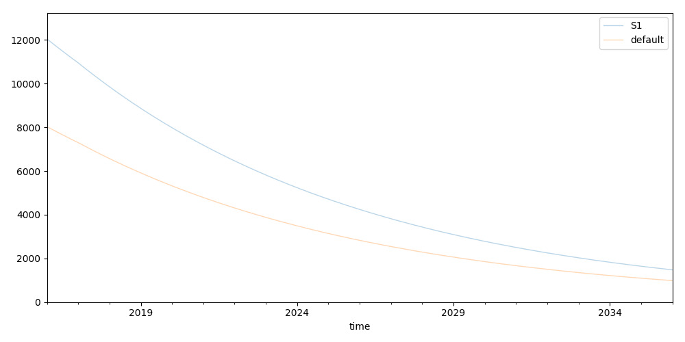
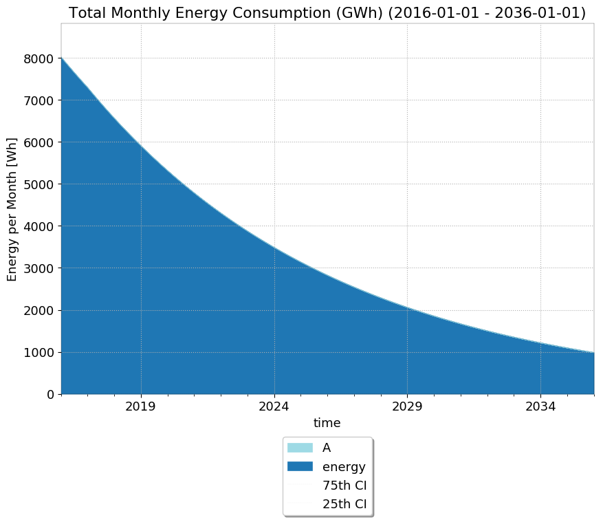
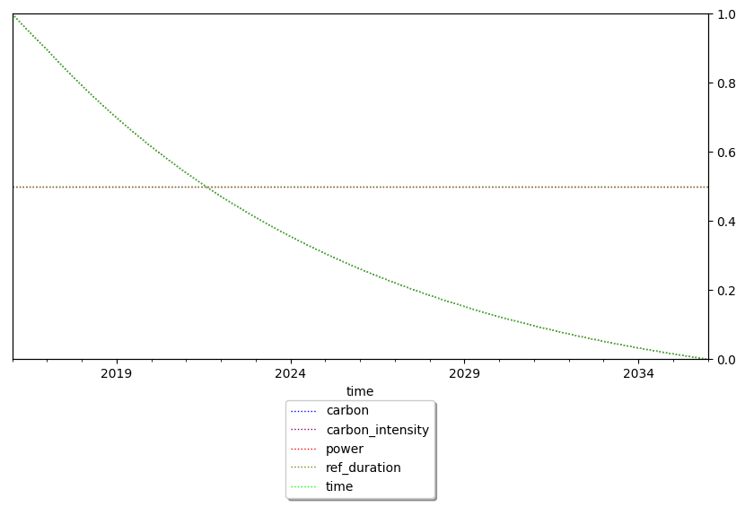
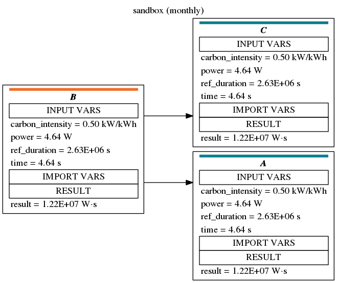

Analysis Config
---------------------
What is it? -- A subsection of the `Metadata` section to control what analysis to perform after simulation.
Separate `analysis_configs` can be created. For example basic, fast analysis for development and a full analysis for publication. 
 
The `analysis_configs` depends on the separate `Analysis` section that controls global analysis. 

Below an example from `sandbox.yml` file.

```yaml
Analysis:

  scenarios:
    - S1

  result_variables:
    - energy

  units:
    - __eq__: energy
      to_unit: Wh

  numerical:
    - energy

  plots:
    - name: process_grid
      variable: energy
      kind: grid
      title: Monthly Energy Consumption per Process

    - name: all_area
      variable: energy
      kind: area
      title: Total Monthly Energy Consumption (GWh)
      ylabel: Energy per Month [{unit}]
      xlabel: Time
      groups:
        - name: A
          categories:
            category: A

Metadata:
  model_name: sandbox
  individual_process_graphs_variable: energy
  analysis_configs:
    - name: dev
      named_plots:
        - all_area
        - process_grid

      individual_process_graphs:
        - process C


      process_tree:
        process_group_colours:
          category_name: category
          colours:
            A: '#037E8C'
            B: '#F26C27'

      input_vars:
        variables:
          - power


  file_locations:
    - file_alias: test_data
      file_name: tests/example_model_data.xlsx
      type: local_file
  start_date: 2016-01-01
  end_date: 2036-01-01
  sample_size: 10
  sample_mean: True
```

# `Scenarios`
The `scenarios` section includes all scenarios to be evaluated, in addition to the implicit default scenario.
A scenario is defined by the set of table variables that have an entry in the `Scenario` column.
For each scenario a separate output subfolder is created.

The main output folder also includes a plot that compared all scenarios: 



# result_variables
The list in `result_variables` includes the names of all variable of which the results should be stored to file.

For example, the below process `C`, contains the following variables:
`energy`, `carbon`, `power`, `ref_duration` and `carbon_intensity`
   
```yaml
  - name: C
    formula:
      text: |
        energy = power * ref_duration
        carbon = energy * carbon_intensity
        return energy
```


Files will stored in `hdf5` format with metadata (units) in output scenario subfolders with the name `result_data_{variable}.hdf5`
 
Also, this must include all variables that numeric analysis and plots that should be carried out on. 


# units
Includes all unit conversions that should be applied to variables.

@todo - this will be refactored... 

Example:
```yaml
  units:
    - endswith: energy
      to_unit: GWh
    - __eq__: carbon
      to_unit: Mt
    - __eq__: data_volume
      to_unit: TB
    - __eq__: time
      to_unit: kyear
    - __eq__: result
      to_unit: GWh
```

# numerical
This lists the names of all variables that numerical analysis should be performed on.
At the moment, that is the creation of excel files with sheets for a variety of metrics.

# plots
Declares named plots.

Plots have a name they can be referred to in the yaml config and title and a variable.
They plot the variable for each process in the model. 

Processes can be grouped.

Via the `kind` property several types of plots can be created, largely those that panda provides. 

## Groups
Each group has a name and a criterion that controls association to the group based on metadata.

For example in the below a group is created that includes all processes in which the metadata field `category` has the 
value `A`. 

Groups are exclusive. I.e. a process will not be included in several groups. Groups membership is evaluated in the order they are listed.

Any processes not included in a group will be included on their own.   
```yaml
  groups:
    - name: A
      categories:
        category: A
```


## Grid
```yaml
- name: individual_processes
  variable: energy
  kind: grid
  title: Monthly Energy Consumption per Process
``` 

E.g.

## Area
E.g.



# Metadata analysis_configs
This section declares which analysis to perform for a given simulation run. 
Each has a name and list of plots that should be generated.
E.g

```yaml
 - name: dev
   named_plots:
    - all_area
    - process_grid

   individual_process_graphs:
    - process C

   process_tree:
    process_group_colours:
      category_name: category
      colours:
        A: '#037E8C'
        B: '#F26C27'

   input_vars:
    variables:
      - power
```

## individual_process_graphs
Plots any named variable from individual processes against their input variables.
Each plot shows an output variable on the left y axis and all other variables on a second y axis, normed to 1.

The output is controled with the setting `individual_process_graphs_variable` in the Metadata section.
The output plots are placed in a subdirectory `input_var_plots` in the scenario output folder. 
Each plot is named `{scenario}_input_vars_{process name}`.

E.g. 


# process_tree
A tree structure showing the topology of the model and the values of export, input, import and result variables.
  
E.g. 

The `process_group_colours` control colour bars for node boxes.  


# input_vars
A grid plot of input variables (table variables). If no variables are explicitly listed, all variables will be plotted.

Eg.
```yaml
input_vars:
```

Example plot
E.g. 